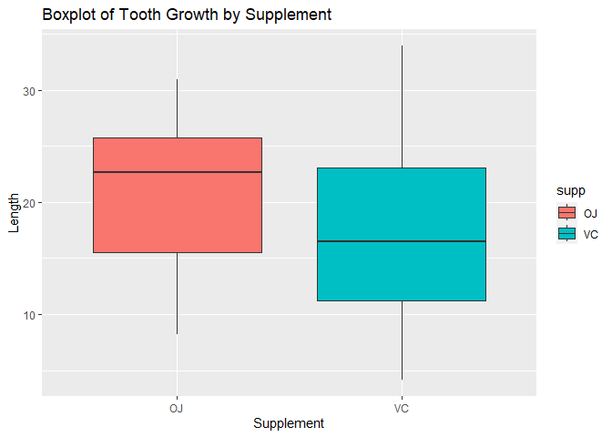
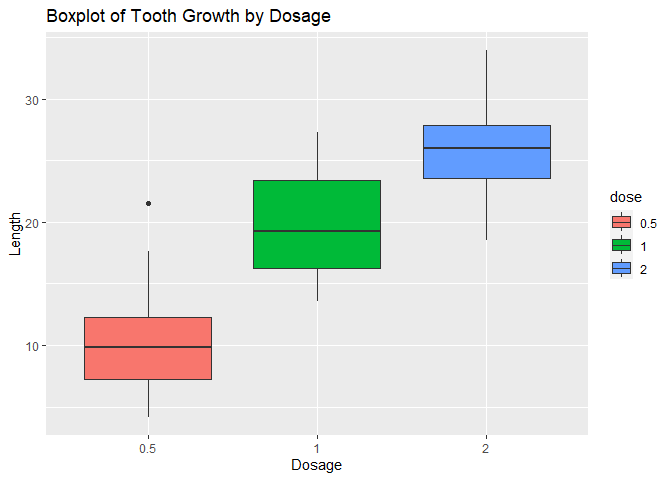

# Basic Inferential Data Analysis

In the second portion of the project, we’re going to analyze the
ToothGrowth data in the R datasets package. From the R Documentation,
ToothGrowth measures the effect of vitamin C on the length of
odontoblasts (cells responsible for tooth growth) in 60 guinea pigs.Each
animal received one of three dose levels of vitamin C (0.5, 1, and 2
mg/day) by one of two delivery methods, orange juice (OJ) or ascorbic
acid (a form of vitamin C and coded as VC).

## Load ToothGrowth Data and Basic Exploratory Data Analyses

``` r
# load datasets and ggplot2 packages and ToothGrowth data
library(datasets); library(ggplot2)

data(ToothGrowth)

# examine structure of ToothGrowth
str(ToothGrowth)
```

    ## 'data.frame':    60 obs. of  3 variables:
    ##  $ len : num  4.2 11.5 7.3 5.8 6.4 10 11.2 11.2 5.2 7 ...
    ##  $ supp: Factor w/ 2 levels "OJ","VC": 2 2 2 2 2 2 2 2 2 2 ...
    ##  $ dose: num  0.5 0.5 0.5 0.5 0.5 0.5 0.5 0.5 0.5 0.5 ...

`ToothGrowth` has 60 observations of 3 variables: length, supplement (OJ
or VC), and dose (0.5, 1, 2).

For convenience, the dataset will be subsetted by supplement and dosage.

``` r
# change dose to factor variable
ToothGrowth$dose <- as.factor(ToothGrowth$dose)

# subset length measurements by supplement and also dosage
ojlength <- subset(ToothGrowth, supp == 'OJ')$len
vclength <- subset(ToothGrowth, supp == 'VC')$len
length05 <- subset(ToothGrowth, dose == 0.5)$len
length1 <- subset(ToothGrowth, dose == 1)$len
length2 <- subset(ToothGrowth, dose == 2)$len
```

## Basic Summary of Data

``` r
table(ToothGrowth$dose,ToothGrowth$supp)
```

    ##      
    ##       OJ VC
    ##   0.5 10 10
    ##   1   10 10
    ##   2   10 10

Each supplement was administered to 30 guinea pigs, and for each
supplement, there are three subgroups of 10 guinea pigs who received the
three dosage levels.

### Tooth Growth by Supplement

Provide summary of `len` by `OJ`.

``` r
summary(ojlength)
```

    ##    Min. 1st Qu.  Median    Mean 3rd Qu.    Max. 
    ##    8.20   15.53   22.70   20.66   25.73   30.90

Provide summary of `len` by `VC`.

``` r
summary(vclength)
```

    ##    Min. 1st Qu.  Median    Mean 3rd Qu.    Max. 
    ##    4.20   11.20   16.50   16.96   23.10   33.90

Plot a boxplot of `len` by `supp`.

``` r
g <- ggplot(ToothGrowth)
g + geom_boxplot(aes(supp, len, fill = supp)) +
        labs(title = 'Boxplot of Tooth Growth by Supplement',
             x = 'Supplement', y = 'Length')
```



From the summaries and boxplot above, orange juice, on average, is a
more effective delivery method for increasing tooth growth. Ascorbic
acid has greater variability in length than OJ; which will be calculated
below.

``` r
tapply(ToothGrowth$len, ToothGrowth$supp, var)
```

    ##       OJ       VC 
    ## 43.63344 68.32723

### Tooth Growth by Dosage

Provide summary of `len` by `0.5`.

``` r
summary(length05)
```

    ##    Min. 1st Qu.  Median    Mean 3rd Qu.    Max. 
    ##   4.200   7.225   9.850  10.605  12.250  21.500

Provide summary of `len` by `1`.

``` r
summary(length1)
```

    ##    Min. 1st Qu.  Median    Mean 3rd Qu.    Max. 
    ##   13.60   16.25   19.25   19.73   23.38   27.30

Provide summary of `len` by `2`.

``` r
summary(length2)
```

    ##    Min. 1st Qu.  Median    Mean 3rd Qu.    Max. 
    ##   18.50   23.52   25.95   26.10   27.82   33.90

Plot a boxplot of `len` by `dose`.

``` r
g <- ggplot(ToothGrowth)
g + geom_boxplot(aes(dose, len, fill = dose)) +
        labs(title = 'Boxplot of Tooth Growth by Dosage',
             x = 'Dosage', y = 'Length')
```



From the summaries and boxplot above, it shows that a higher dosage
results in longer lengths of odontoblasts.

### Tooth Growth by Supplement and Dosage

Plot a boxplot of length, by supplement and dosage:

``` r
g <- ggplot(ToothGrowth)
g + geom_boxplot(aes(dose, len, fill = dose)) +
        facet_grid(.~supp) +
        labs(title="Tooth Length of Guinea Pigs by Dosage and Supplement",
             x="Dosage", y="Length")
```


It appears that increasing the dosage from 1 mg/day to 2 mg/day for
orange juice did not have as much of an effect on the mean length as
other dosage increases. Furthermore, there does not seem to be much a
difference in mean length between supplements at the 2 mg/day dosage
level.

## Hypothesis Testing

### Tooth Growth by Supplement

Perform a T-test for a statistically significant difference in mean
length between ascorbic acid and orange juice. The groups are not
paired, and assume unequal variance; these are `FALSE` by default.

``` r
t.test(vclength, ojlength)
```

    ## 
    ##  Welch Two Sample t-test
    ## 
    ## data:  vclength and ojlength
    ## t = -1.9153, df = 55.309, p-value = 0.06063
    ## alternative hypothesis: true difference in means is not equal to 0
    ## 95 percent confidence interval:
    ##  -7.5710156  0.1710156
    ## sample estimates:
    ## mean of x mean of y 
    ##  16.96333  20.66333

Since the p-value, 0.06063, is greater than 0.05, we fail to reject the
null hypothesis that the difference in mean length for acsorbic acid and
orange juice is zero.

### Tooth Growth by Dose

For the following tests, the groups are not paired, and assume unequal
variance.

Perform T-tests for a statistically significant difference in mean
length for each dosage.

``` r
# 0.5 vs 1
t.test(length05, length1)
```

    ## 
    ##  Welch Two Sample t-test
    ## 
    ## data:  length05 and length1
    ## t = -6.4766, df = 37.986, p-value = 1.268e-07
    ## alternative hypothesis: true difference in means is not equal to 0
    ## 95 percent confidence interval:
    ##  -11.983781  -6.276219
    ## sample estimates:
    ## mean of x mean of y 
    ##    10.605    19.735

``` r
# 1 vs 2
t.test(length1, length2)
```

    ## 
    ##  Welch Two Sample t-test
    ## 
    ## data:  length1 and length2
    ## t = -4.9005, df = 37.101, p-value = 1.906e-05
    ## alternative hypothesis: true difference in means is not equal to 0
    ## 95 percent confidence interval:
    ##  -8.996481 -3.733519
    ## sample estimates:
    ## mean of x mean of y 
    ##    19.735    26.100

``` r
# 0.5 vs 2
t.test(length05, length2)
```

    ## 
    ##  Welch Two Sample t-test
    ## 
    ## data:  length05 and length2
    ## t = -11.799, df = 36.883, p-value = 4.398e-14
    ## alternative hypothesis: true difference in means is not equal to 0
    ## 95 percent confidence interval:
    ##  -18.15617 -12.83383
    ## sample estimates:
    ## mean of x mean of y 
    ##    10.605    26.100

The p-values for all three tests were less than 0.05, thus we reject the
null hypothesis that the difference in means is zero. In other words
there is a statistically significant increase in length as dosage
increases.

### Further Testing

As mentioned earlier, there did not seem to be much of a difference in
mean length for 1 mg/day and 2 mg/day in the orange juice group. Nor did
there seem to be a difference for the 2 mg dosage between each
supplement group. These will be further tested below.

``` r
ojlength1 <- subset(ToothGrowth, supp == 'OJ' & dose == 1)$len
ojlength2 <- subset(ToothGrowth, supp == 'OJ' & dose == 2)$len

# OJ: 1 vs 2
t.test(ojlength1, ojlength2)
```

    ## 
    ##  Welch Two Sample t-test
    ## 
    ## data:  ojlength1 and ojlength2
    ## t = -2.2478, df = 15.842, p-value = 0.0392
    ## alternative hypothesis: true difference in means is not equal to 0
    ## 95 percent confidence interval:
    ##  -6.5314425 -0.1885575
    ## sample estimates:
    ## mean of x mean of y 
    ##     22.70     26.06

Since the p-value was less than 0.05, we reject the null hypothesis that
the difference in mean length between 1 mg/day and 2 mg/day dosage in
the orange juice group is zero. It may be worth noting that the p-value
is is close to 0.04, and the null hypothesis could be rejected for lower
alpha levels. This is also reflected in the 95% confidence interval; the
maximum is -0.1885575, which is somewhat close to zero.

``` r
vclength2 <- subset(ToothGrowth, supp == 'VC' & dose == 2)$len

# 2 vs 2
t.test(ojlength2, vclength2)
```

    ## 
    ##  Welch Two Sample t-test
    ## 
    ## data:  ojlength2 and vclength2
    ## t = -0.046136, df = 14.04, p-value = 0.9639
    ## alternative hypothesis: true difference in means is not equal to 0
    ## 95 percent confidence interval:
    ##  -3.79807  3.63807
    ## sample estimates:
    ## mean of x mean of y 
    ##     26.06     26.14

The p-value is over 0.05, thus we fail to reject the null hypothesis. In
other words, there is no statistically significant difference in mean
length between orange juice and ascorbic acid at a 2 mg/day dosage
level.

## Assumptions and Conclusions

The following were some assumptions made:

1.  The sample of 60 guinea pigs was representative of the guinea pig
    population
2.  The samples are random iid
3.  The population distribution of each sample group is approximately
    normal or mound shaped and roughly symmetric.

Thus we can conclude:

1.  Supplement type does not affect the mean of length of the
    odontoblasts.
2.  An increase in dosage results in an increase in tooth growth.
3.  At 2 mg/day dosage, both supplements perform similarly.
